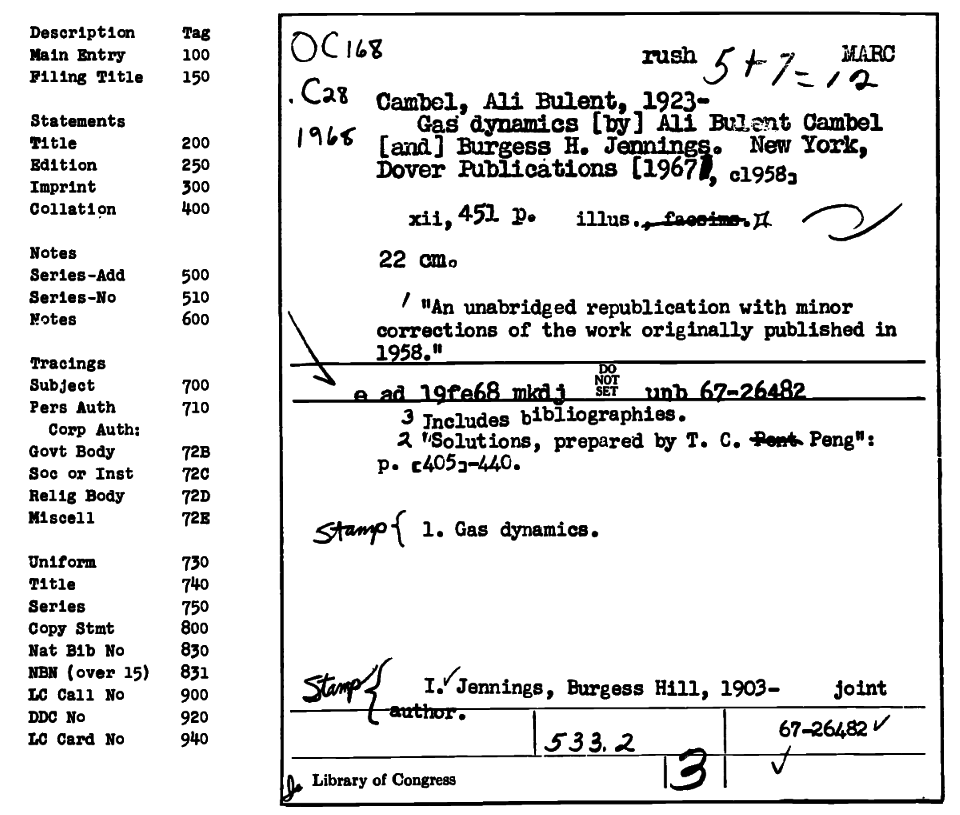
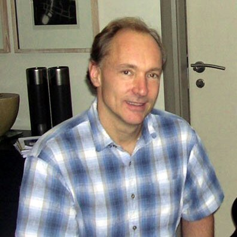
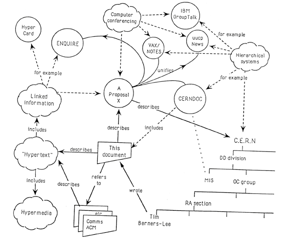
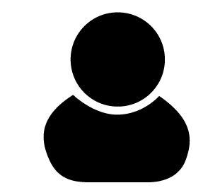
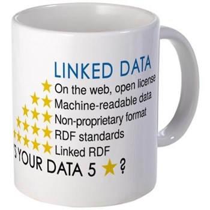
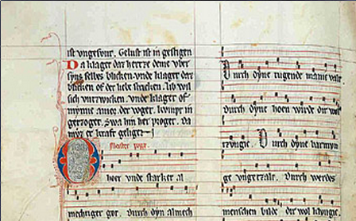
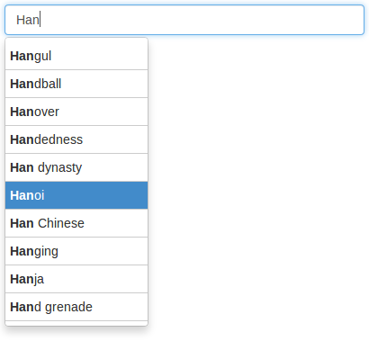

\takastack{everything is connected\\\onslide<2>with everything}

---

---

---

\taka{What is a \textbf{\textcolor{white}{useful}} connection?}

---

\taka{What is a \textbf{useful} connection?}

---

\taka{connections that work}

---

\takastack{
    connection that can be processed\\
    \onslide<2>\textbf{automatically}
}

---

\takastack{connection expressed as\\Linked Open Data}

---

# Overview

\bigfont

1. History
2. Present
3. Future

---

\taka{History}

---

---

---

---

# Machine Readable Cataloging (MARC)

good...

* encoding of bibliographic information as data
* controlled collaboration

...but...

* primary use case: printed cards

---

---

---

# World Wide Web (WWW)

good...

* worldwide connections
* uncontrolled collaboration

...but...

* only for browsing interfaces

---

\taka{Present}

---

# Semantic Web

good...

* data integration and analysis
* semi-controlled collaboration

...but...

* promises of artificial intelligence

# Linked Open Data (LOD)

good...

* data integration and analysis
* semi-controlled collaboration

...but...

* ~~promises of artificial intelligence~~

---

# Linked Open Data (LOD)

sounds nice...

* encoding of information as data
* worldwide connections
* data integration and analysis

*...but how does it actually work?*

---

\takastack{a little theory of data}

---

# Data

* all data refers to something

. . .

* some data refer to the same thing

. . .

* for instance the same person
    * as author in a library catalog
    * in a university research management system
    * Wikipedia article about the person
    * ...

# "Old School" Library Linked Data

authority files
  : registry, classification, thesaurus...
controlled vocabularies
  : no homonyms/synonyms
identifier
  : notations, codes, numbers...

. . .

same identifier $\Rightarrow$ data refers to the same thing

---

\takastack{unique identification\\\onslide<2>with \textbf{URIs}}

---

\taka{an example}

---

---

---

---

unique identification of things

* "author:"\
   <http://d-nb.info/gnd/118578545>

---

\text{unique identification of things \onslide<2> and connections\onslide<1->}

* **object:**\
  <http://d-nb.info/gnd/118578545>\
  ("Karl Marx, the artists")

. . .

* **property:**\
  <http://purl.org/dc/terms/creator>\
  ("authorship, as defined by Dublin Core")

---

# Ei kaksi kolmannetta

* **subject:**\
  <http://d-nb.info/940697734>\
  ("a specific book with paintings")
* **property:**\
  <http://purl.org/dc/terms/creator>\
  ("authorship, as defined by Dublin Core")
* **object:**\
  <http://d-nb.info/gnd/118578545>\
  ("Karl Marx, the artists")

. . .

*hey, that's an RDF triple!*

---

\taka{technical break}

---

# An RDF triple (N-Triples syntax)

    <http://d-nb.info/940697734>
    <http://purl.org/dc/terms/creator>
    <http://d-nb.info/gnd/118578545> .

# An RDF triple (Turtle syntax)

    @prefix dct: <http://purl.org/dc/terms/> .

    <http://d-nb.info/940697734>
    dc:creator 
    <http://d-nb.info/gnd/118578545> .

# An RDF triple (aREF syntax)

    http://d-nb.info/940697734:
      dc_creator:
        http://d-nb.info/gnd/118578545

. . .

*RDF syntax converters exist.*

. . .

*always use the RDF syntax you understand best!*

. . .

*(nobody understands RDF/XML syntax)*

# Multiple RDF triples (Turtle syntax)

    @prefix dct: <http://purl.org/dc/terms/> .
    @prefix foaf: <http://xmlns.com/foaf/0.1/> .

    <http://d-nb.info/940697734>
    dct:title "Gemälde" ;
    dct:creator <http://d-nb.info/gnd/118578545> .

    <http://d-nb.info/gnd/118578545>
    foaf:name "Karl Marx" .

# That's RDF!

* all things identified by URIs
* all data consists of triples
    * subject (always an URI)^[or a blank node]
    * property (always an URI)
    * object (URI or character string)$^2$

---

# Ontologies

set of common properties and rules

* `foaf:name` (<http://xmlns.com/foaf/0.1/name>)
* `dct:title` (<http://purl.org/dc/terms/title>)

. . .

more specialized ontologies exist

* schema.org
* RDA-ontology and BIBFRAME

---

\takastack{end of technical break.\\wake up!}

---

# Lesson learned

* RDF data consists of triples

. . .

* subjects, properties, and most objects\
  identified by URIs

. . .

* common properties from ontologies

. . .

*$\Longrightarrow$ easy to mix and merge!*

---

\takastack{summary of the present\\linked open data}

---

# Linked Open Data

1. **Data**\
   with URIs, in RDF

. . .

2. **Open**\
   accesible via HTTP-URIs

. . .

3. **Linked**\
   contains other HTTP-URIs

---

---

\takastack{
    Linked RDF\\\onslide<2>
    contains \emph{other} HTTP-URIs
}

---

---

\taka{Future \onslide<2> of cataloging}

---

\taka{cataloging?}

---

\takastack{
    intellectual creation of data\\\onslide<2>
    about existing works
}

---

# creation of data about existing works

1. digitization

. . .

2. connections

# digitization

. . .

*required only once per work*

# creation of data about existing works

1. digitization

2. connections

. . .

*infinite combination of connections*

# connections that work

* selection from already existing URIs
* with appropriate tools

# benefits

* common data format
* accessibility of data
* flexible aggregation and subsets
* collaborative creation

# disadvantages

* not all data can be expressed in RDF the same way\
  (e.g. hierarchies and order is difficult)
* data mdeling is complicated\
  because the things are complicated

---

\taka{where to start?}

---

# Linked Data Finland 

<http://www.ldf.fi/>

*please contact to share **your** datasets!*

---

\taka{summary}

---

\takastack{
    everything can be connected
    \onslide<2> with URIs
    \onslide<3> as soon as you connect it!
}

---

# Conferences

SWIB
  : Semantic Web in Libraries (since 2009)\
    <http://swib.org/>

LODLAM
  : Linked Open Data in Libraries, Archives, and Museums (since 2011)\
    <http://lodlam.net>

# Image sources

\smallfont

* Six degrees of separation by Daniel Walker (User:Dannie-walker)

* *Linking Open Data cloud diagram* (2014) by Max Schmachtenberg, Christian Bizer,
  Anja Jentzsch and Richard Cyganiak <http://lod-cloud.net/> 

* Henriette Avram from <http://www.loc.gov/loc/lcib/0605/avram.html>

* *Information Management: A Proposal* (1989) by Tim-Berners-Lee.
  <http://www.w3.org/History/1989/proposal.html>

* Tim Berners-Lee (2005) by Uldis Bojārs from Flickr

---

\taka{thanks!}

---

\taka{questions!}

