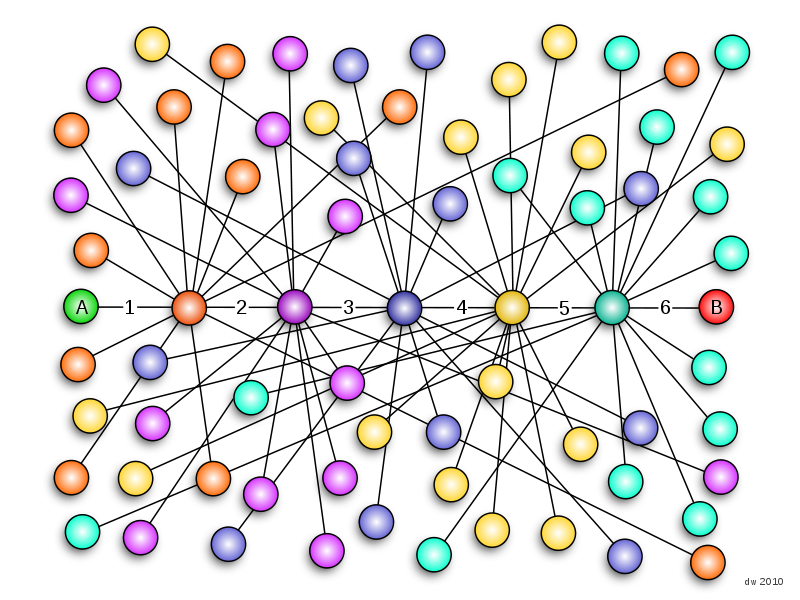
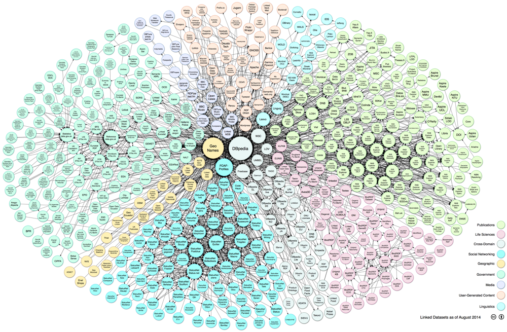

\takastack{everything is connected\\\onslide<2>with everything}

---



---



---

\taka{What is a \textbf{\textcolor{white}{useful}} connection?}

---

\taka{What is a \textbf{useful} connection?}

---

\taka{connections that work}

---

\takastack{
    connection that can be processed\\
    \onslide<2>\textbf{automatically}
}

---

\takastack{connection expressed as\\Linked Open Data}

---

# Overview

\bigfont

1. History
2. Present
3. Future

---

\taka{History}

---


---


---


---

# Machine Readable Cataloging (MARC)

good...

* encoding of bibliographic information as data
* controlled collaboration

...but...

* primary use case: printed cards

---


---


---


# World Wide Web (WWW)

good...

* worldwide connections
* uncontrolled collaboration

...but...

* only for browsing interfaces

---

\taka{Present}

---


# Semantic Web

good...

* data integration and analysis
* semi-controlled collaboration

...but...

* promises of artificial intelligence

# Linked Open Data (LOD)

good...

* data integration and analysis
* semi-controlled collaboration

...but...

* ~~promises of artificial intelligence~~

---

Sounds nice...

* encoding of information as data
* worldwide connections
* data integration and analysis

*...but how does it actually work?*

---

\takastack{History}
once again

---

# "Old School" Library Linked Data

Authority files
  : registry, classification, thesaurus...
controlled vocabularies
  : no homonyms/synonyms
identifier
  : notations, codes, numbers...

---

\takastack{unique identification\\\onslide<2>with \textbf{URIs}}

---

\taka{``things, not strings''}

---

\takastack{Present}
here we are

---

A lot of connections between data

* Hier: **Daten** die mit anderen Daten zusammenhängen
* Linked Open Data

# Daten die mit anderen Daten zusammenhängen

* Verschiedene Daten beschreiben die gleiche Dinge

* Zum Beispiele **die gleiche Person**
    * Person als Autor in Katalogdatenbank
    * Objekte der Person im Bestandsverzeichnis eines Museums
    * Wikipedia-Artikel über die Person
    * ...


# Henriette Avram

* http://viaf.org/viaf/18236820
* http://d-nb.info/gnd/127119507
* https://www.wikidata.org/wiki/Q10953
* ...

The MARC pilot project (1968)

* http://d-nb.info/577273116
* http://www.worldcat.org/oclc/721117733

---

---

\bigfont

* **not** "somehow" connected
* **but** connected in a defined way

---

# Linked Data Finland 


<http://www.ldf.fi/>

*please contact to share **your** datasets!*

---

\taka{Future}

---

cataloging

# Conferences

SWIB
  : Semantic Web in Libraries (since 2009)\
    <http://swib.org/>

LODLAM
  : Linked Open Data in Libraries, Archives, and Museums (since 2011)\
    <http://lodlam.net>

# Image sources

\smallfont

* Six degrees of separation by Daniel Walker (User:Dannie-walker)

* *Linking Open Data cloud diagram* (2014) by Max Schmachtenberg, Christian Bizer,
  Anja Jentzsch and Richard Cyganiak <http://lod-cloud.net/> 

* Henriette Avram from <http://www.loc.gov/loc/lcib/0605/avram.html>

* *Information Management: A Proposal* (1989) by Tim-Berners-Lee.
  <http://www.w3.org/History/1989/proposal.html>

* Tim Berners-Lee (2005) by Uldis Bojārs from Flickr


---

```
catmandu convert RDF --url http://viaf.org/viaf/18236820.rdf to YAML
catmandu convert RDF --url http://www.wikidata.org/entity/Q10953 to YAML
